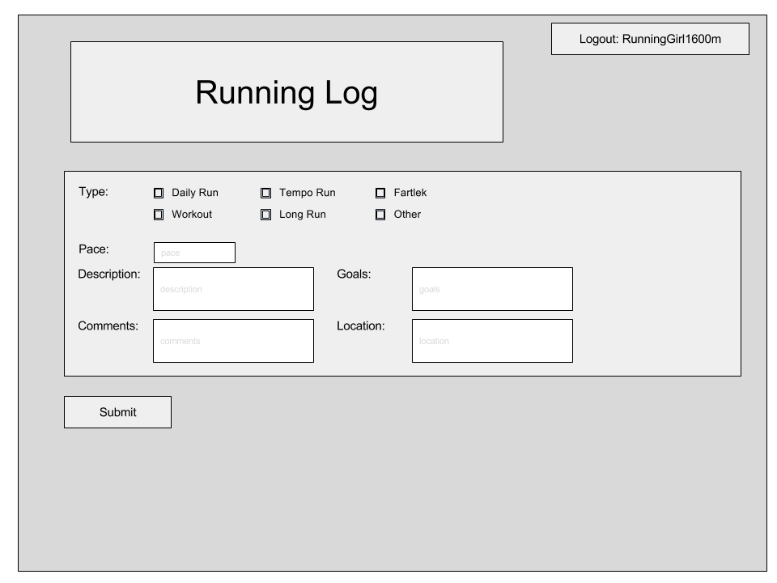
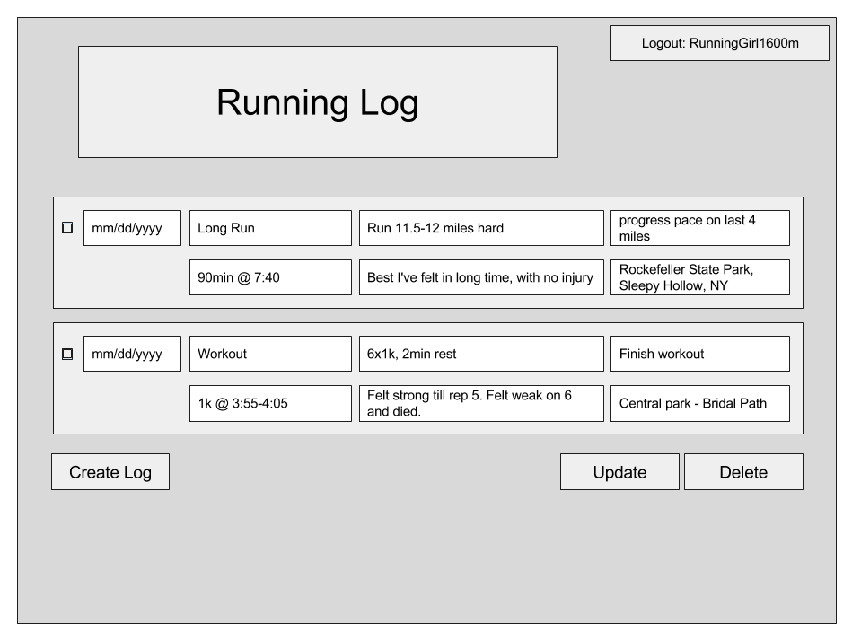
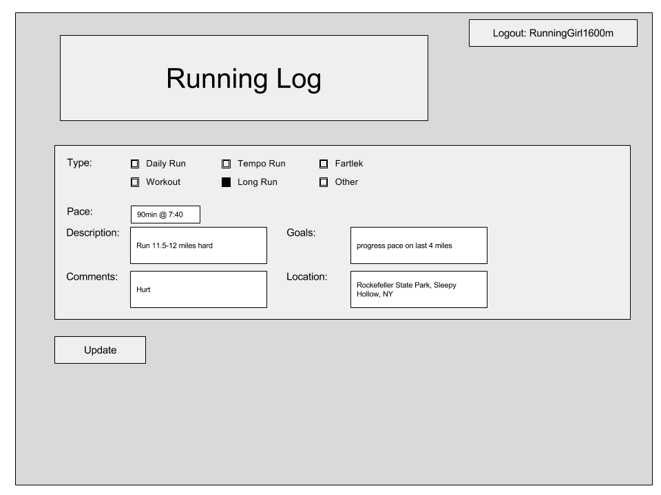
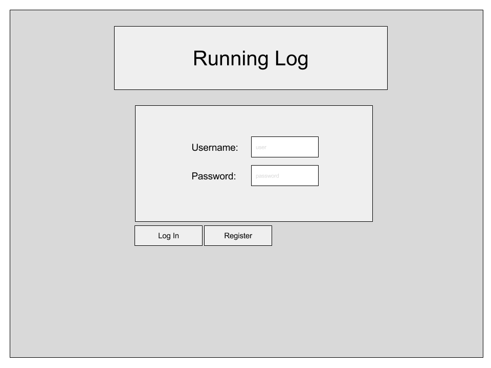
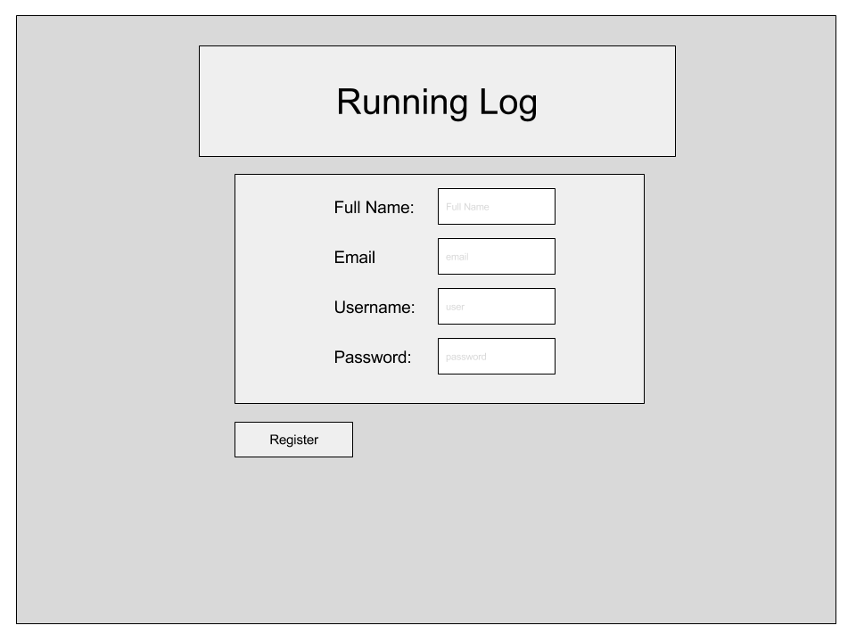
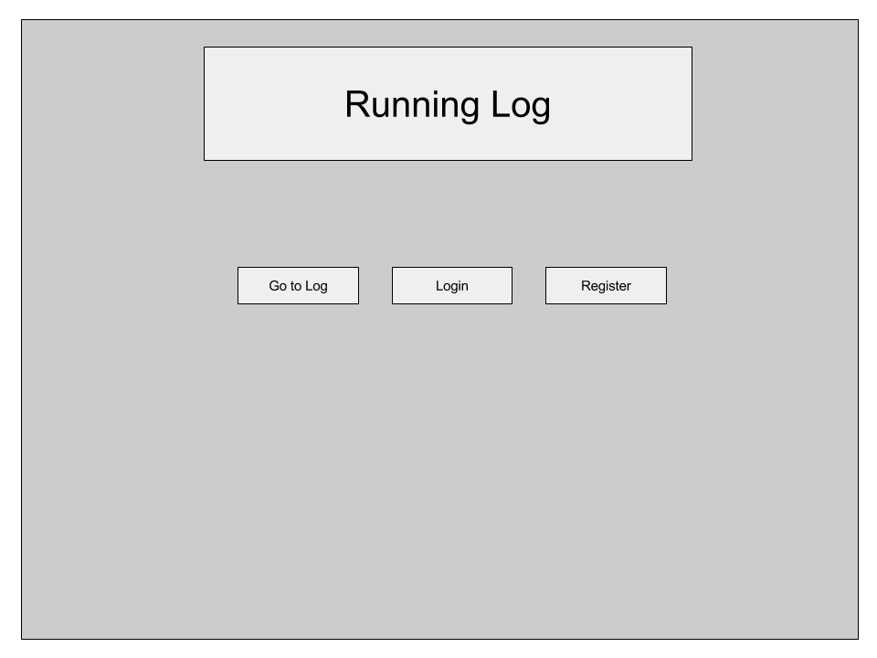
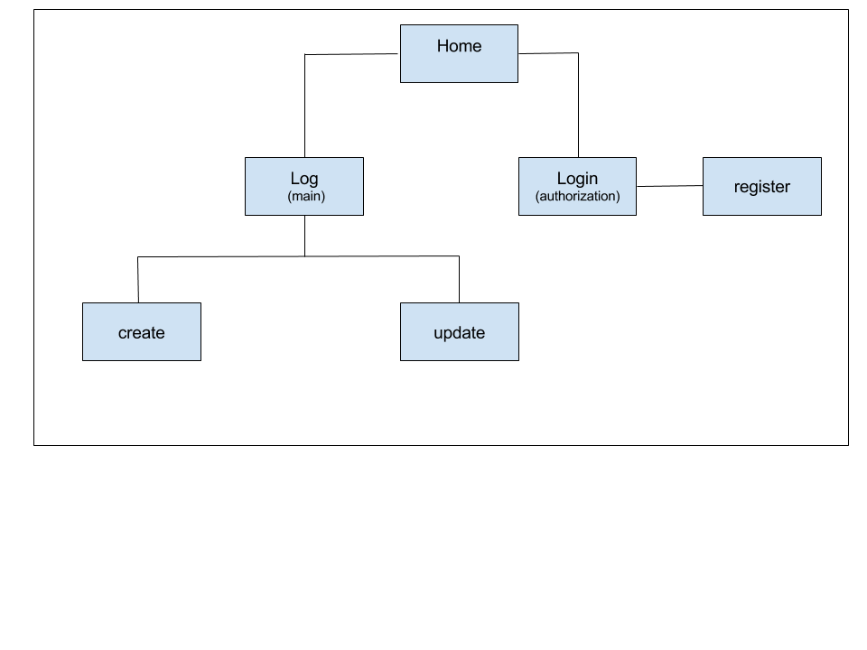

# Runner Log 

## Overview

As a student-athlete on both the Cross Country and Track & Field team, it is important to log our runs daily. As a team we have used various running log sites, all of which are terrible. Every site that we have tried is glitchy and fails us. This is why I'd created this web app. 

My goal was to make a site that is as user friendly as possible but that suits the needs of runners. This web app will allow users to create/delete each log as they please. There are three types of logs the user can use. One log is for daily runs that has multiple fields that the user can fill out on the form. There is also a page for the user to log their meals and races. Both have multiple fields to fill out. There is a page that calculates the number of calories a runner should eat in a day, although its recommended to eat a high counts when more active.

When the user attempts to visit the web app from any page, they will be redirected to login if their not logged in, or they can signup. After signing up or logging in they'll be redirected to the home page, that has the weather for New York and a map that the user can use to find their next run. 

## Data Model

The application will store Users and Logs

* users can have multiple Logs
* each Log can have the same information and be created, updated or deleted

An Example User:

```javascript
{
  username: "RunnerGirl1600m",
  hash: // a password hash,
  lists: // an array of references to List documents
}
```
An Example List with Embedded Items:

```javascript
{
  user: // a reference to a User object
  Log: [
    { editDelete: false, date: /*timestamp*/, type: "Long Run", description: "Run 11.5-12 miles hard" pace: "90min @ 7:40", goals: "progress pace on last 4 miles", comments: "Best I've felt in long time, with no injury", location: "Rockefeller State Park, Sleepy Hollow, NY" },

    { editDelete: false, date: /*timestamp*/, type: "Workout", description:" 6x1k, 2min rest", pace: "1k @ 3:55-4:05", goals: "Finish workout", comments: "Felt strong till rep 5. Felt weak on 6 and died.", location: "Central park - Bridal Path" },
  ]
}
```
## [Link to Commented First Draft Schema](db.js) 

## Wireframes

/log/create - page for creating a new log



/log - page for showing all logs



/log/update - page for showing/updating specific log



/log/login - page to login



/log/register - page to register



/home - Home



## Site map



## User Stories or Use Cases

1. as non-registered user, I can register a new account with the site for free
2. as a user, I can log in to the site
3. as a user, I can create a new running log
4. as a user, I can update a running log
5. as a user, I can delete a running log
6. as a user, I can view all of the running logs I've created in a single list
7. as a user, I can map out my run on the running API

## Research Topics

* (5 points) Integrate user authentication
    * I'm going to try to use passport for user authentication
    * Also would like to try to use google-signin authentication
    * Passport offers many different forms of user authentication such as facebook, twitter, LinkedIn
    * Will need user authentication on my logIn screen
    * Use of this will provide ease for user to possibly not have to manually register

* (3 points) Perform client side form validation using a JavaScript library
    * User validation to make sure user properly signed up or logged in
    * Validate will also check to see that all the fields in the log we completed
    * Will double check to see if user wanted to delete or update log
    * Will try to use validate.js

* (1 point) Google API
    * use google api to let user map/create their run - if possible

9 points total out of 8 required points

## [Link to Initial Main Project File](app.js) 

## Annotations / References Used

1. http://www.passportjs.org (for user authentication)
2. https://firebase.google.com/docs/auth/web/google-signin (for user authentication - might try to use google login)
3. https://www.w3schools.com/js/js_htmldom_nodes.asp (validation)
4. https://validatejs.org 
